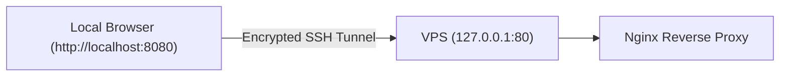

# Pre-Domain Private Testing Runbook

## Overview
When deploying to a VPS **before a production domain name and TLS certificate are provisioned**, the application must **NOT** be exposed publicly over unencrypted HTTP by IP address.

---

## 1. Why Public IP HTTP Testing is Discouraged

1. **Security Risk:** Plaintext HTTP exposes JWT refresh cookies and login credentials across the public internet.
2. **Missing Cookie Security:** Browsers reject `Secure` cookies over non-HTTPS connections, causing auth flow discrepancies.
3. **Automated Abuse:** Raw public IP addresses on port 80 are immediately probed by automated vulnerability scanners and malicious crawlers.

---

## 2. Recommended Method: Encrypted SSH Local Port Forwarding

Test the remote VPS deployment securely from your local workstation using an SSH tunnel.



### Execution Steps

1. Establish an SSH tunnel from your local machine to the VPS:
   ```bash
   ssh -L 8080:localhost:80 carmats-deploy@<VPS_IP_ADDRESS>
   ```

2. Open your browser and navigate to:
   ```
   http://localhost:8080
   ```

3. Perform complete end-to-end testing:
   - Storefront navigation (`/`, `/katalog`)
   - Vehicle selector filtering
   - User registration and login
   - Cart additions and checkout UI flow
   - Admin panel access (`/admin`)

4. When testing is complete, simply close the SSH session.

---

## 3. Alternative: Localhost-Bound Nginx

In `/opt/carmats/.env`, configure Nginx to bind only to localhost:
```env
NGINX_PORT=127.0.0.1:80
```
This ensures Nginx will reject any connection not originating from the local machine or an established SSH tunnel.
